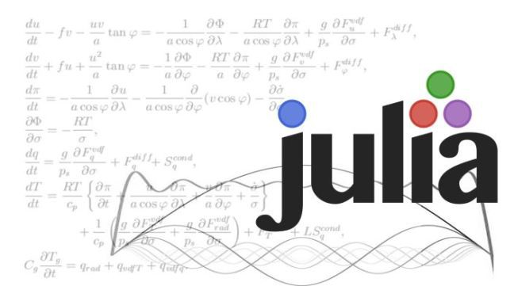

# [Julia Language](https://docs.julialang.org/en/v1/)

"Julia is a flexible dynamic language, appropriate for scientific and numerical computing, with performance comparable to traditional statically-typed languages."

## Goal

Repository to study and explore the Julia language with examples and [tutorial](https://docs.julialang.org/en/v1/manual/getting-started/).

## Setup Language

Install the language with this [link](https://julialang.org/downloads/#current_stable_release).

If you will have problems with the path Julia, access the [link](https://julialang.org/downloads/platform/#installation_notes).

## Run codes

To run the code at runtime you can put the command line in the terminal:

```sh
$ julia
```

To run the julia file code, you can run the command:

```sh
$ julia file.jl arg1 arg2...
```